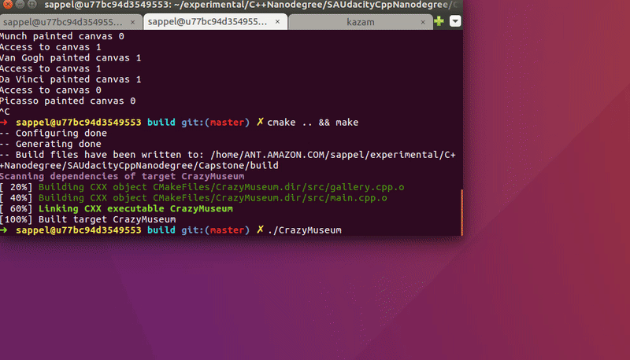

# Capstone: The Crazy Museum

This is the Capstone project in the [Udacity C++ Nanodegree Program](https://www.udacity.com/course/c-plus-plus-nanodegree--nd213).  
I got the motivation from my vacation in Malaga, Spain when I entered the Pablo Picasso Museum there and thought about the power of creating art in parallel with the use of multi-threading.

## Dependencies for Running Locally
* cmake >= 2.8
  * All OSes: [click here for installation instructions](https://cmake.org/install/)
* make >= 4.1 (Linux, Mac), 3.81 (Windows)
  * Linux: make is installed by default on most Linux distros
  * Mac: [install Xcode command line tools to get make](https://developer.apple.com/xcode/features/)
  * Windows: [Click here for installation instructions](http://gnuwin32.sourceforge.net/packages/make.htm)
* OpenCV >= 3.3
  * The OpenCV 3.3.0 source code can be found [here](https://github.com/opencv/opencv/tree/3.3.0)
* gcc/g++ >= 5.4
  * Linux: gcc / g++ is installed by default on most Linux distros
  * Mac: same deal as make - [install Xcode command line tools](https://developer.apple.com/xcode/features/)
  * Windows: recommend using [MinGW](http://www.mingw.org/)

## Basic Build Instructions

1. Clone this repo.
2. Make a build directory in the top level directory: `mkdir build && cd build`
3. Compile: `cmake .. && make`
4. Run it: `./CrazyMuseum`.

## Description

Welcome to the Crazy Museum where nothing is impossible. By entering the museum you are allowed to specify the number of galleries and famous painters you want to be part of it. Next, you can view the interactive part of art!

## File & Class structure
For this application the following three classes are defined (header files) and implemented (source files).
-   **museum:** The museum class provides the base class for the other two files and is the place where all threads are stored. Moreover, it has a virtual class `simulate` that obligates all derived class to implement it.
-   **gallery:** The gallery class obtain all functionalities about the actual canvas which are the hyperparameters as well as the drawing functions. In addition the class provides a message queue to safely permit one painter at a time into to gallery to become creative.
-   **painter:** The painter class is used to represent a painter together with his/her name and skill level. All painters wait for the access to enter a gallery and then perform their art depending on their skill level.

All header and source files are located in the src/ folder of the top level project directory

## Program Flow

The `main.cpp` sets up the main thread plus all user-defined threads for the number of galleries and painters. After each gallery and painter thread is set up together with their attributes, the program enters the simulation phase, when from time to time a gallery permits the access to manipulate its canvas by the painter who reacts first.

## Rubric points

#### Readme  
* [x] Instructions
* [x] 3rd party libraries: OpenCV
* [x] Description  

#### Compiling and Testing  
* [x] Compile & Run without error

#### Loops, Functions, I/O  
* [x] Functions and Control structures
* [ ] Reads files, process data, outputs it
* [x] Accepts user input & output

#### Object Oriented Programming  
* [x] Organized in classes
* [x] Appropriate access for class members
* [x] Initialization lists
* [x] Clear interfaces
* [x] Encapsulate behaviour
* [x] Inheritance
* [ ] Overloaded functions
* [x] Override virtual functions
* [ ] Templates

#### Memory Management  
* [x] Pass-by-reference
* [x] Appropriate use of destructors
* [x] Uses RAII
* [ ] Follows the Rule of 5
* [ ] Uses move semantics instead of copying
* [x] Smart pointers instead of raw pointers

#### Concurrency  
* [x] Uses multiple threads
* [ ] Uses promise & future
* [x] Uses mutex or lock
* [x] Uses condition variable
